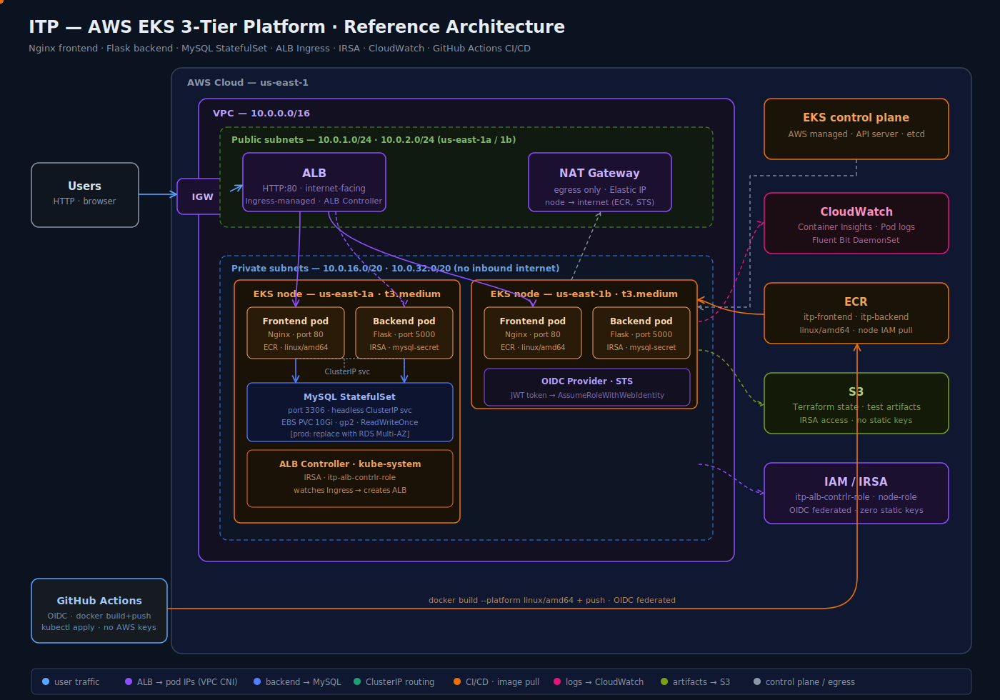
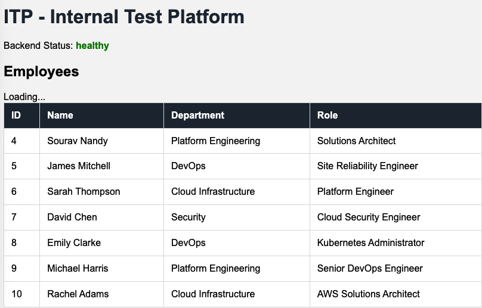
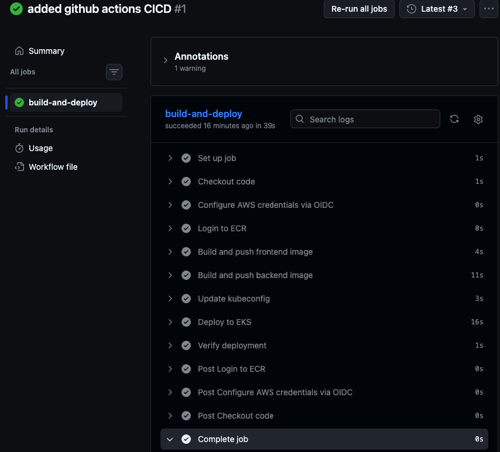
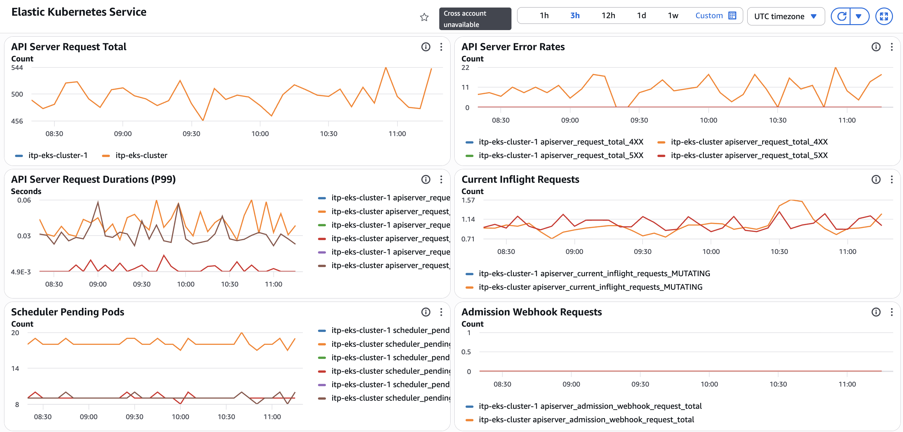
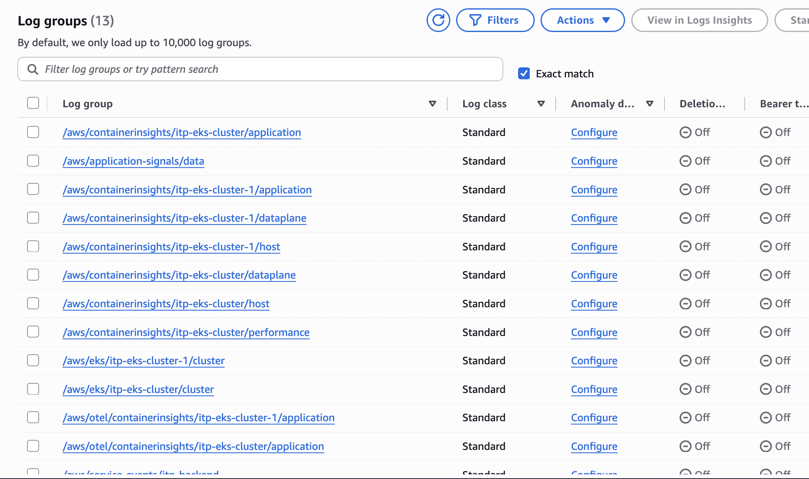
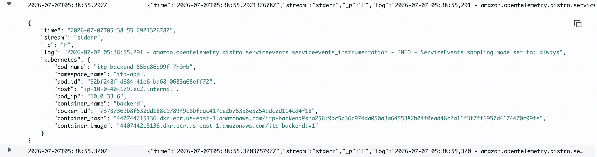
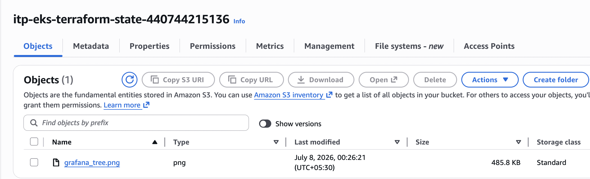
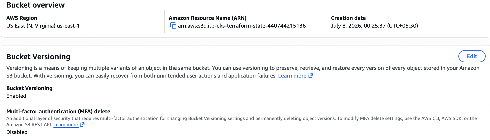

# ITP — AWS EKS 3-Tier Platform

> Production-equivalent reference architecture for a cloud-native 3-tier application on AWS EKS. Built to demonstrate end-to-end platform engineering — from VPC design to CI/CD pipeline — with zero static credentials anywhere in the stack.

**Live demo:** `http://k8s-itpapp-itpingre-2c6c67ef98-1442031030.us-east-1.elb.amazonaws.com`  
**Author:** Sourav Nandy · Solutions Architect & Platform Engineer · CKA  
**Stack:** Nginx · Python Flask · MySQL · AWS EKS · ALB · IRSA · CloudWatch · GitHub Actions

---

## Architecture



---

## What This Project Demonstrates

This is not a tutorial project. It is a reference implementation of the same infrastructure patterns used in production cloud-native platforms — VPC design, EKS cluster setup, zero-credential authentication via IRSA, automated ingress via ALB Controller, persistent storage via EBS, full observability via CloudWatch, and a CI/CD pipeline with OIDC federation.

Every component below was designed, deployed, and debugged from scratch.

---

## Infrastructure — Built from Scratch

### 1. VPC — The Network Foundation

**What it is:** Virtual Private Cloud. An isolated network inside AWS — your own private data center in the cloud.

**What we built:**
- VPC CIDR: `10.0.0.0/16` — 65,536 IP addresses
- ID: `vpc-0c06396e4c158bdfc`
- Region: `us-east-1`

**Why it exists:** Every AWS resource (EC2, EKS nodes, RDS, ALB) lives inside a VPC. Nothing is reachable from the internet unless you explicitly allow it. The VPC is the security boundary for the entire platform.

---

### 2. Subnets — Public vs Private

**What they are:** Subdivisions of the VPC. Each subnet lives in one Availability Zone.

**What we built:**

| Subnet | AZ | CIDR | Purpose |
|--------|----|------|---------|
| Public subnet 1 | us-east-1a | 10.0.1.0/24 | ALB, NAT Gateway |
| Public subnet 2 | us-east-1b | 10.0.2.0/24 | ALB, NAT Gateway |
| Private subnet 1 | us-east-1a | 10.0.16.0/20 | EKS nodes, pods |
| Private subnet 2 | us-east-1b | 10.0.32.0/20 | EKS nodes, pods |

**Why two AZs?** High availability. If one AWS data center goes down, workloads continue running in the other AZ. This is the standard production pattern.

**Why private subnets for nodes?** EKS worker nodes have no direct internet access. The only way into the cluster is through the ALB. Nodes reach the internet (for ECR pulls, AWS API calls) via NAT Gateway — outbound only, no inbound.

---

### 3. Internet Gateway (IGW)

**What it is:** The door between your VPC and the public internet. Without IGW, nothing in your VPC can reach or be reached from the internet.

**What we built:** One IGW attached to the VPC. The public subnets route `0.0.0.0/0` traffic to the IGW. This is how the ALB receives traffic from browsers worldwide.

**Scope:** IGW only serves the public subnets. Private subnets never touch the IGW directly.

---

### 4. NAT Gateway

**What it is:** Network Address Translation Gateway. Allows resources in private subnets to make outbound internet connections without being reachable from the internet.

**What we built:** One NAT Gateway in the public subnet with an Elastic IP. Private subnet route tables send `0.0.0.0/0` to the NAT Gateway.

**Why EKS nodes need it:**
- Pull container images from ECR (AWS API call)
- Call AWS STS for IRSA credential exchange
- Download Kubernetes system packages

**Key concept:** NAT Gateway is for OUTBOUND internet only. Pod-to-Pod, Pod-to-RDS, and all internal VPC traffic routes directly — never touches NAT Gateway.

---

### 5. Security Groups

**What they are:** Stateful virtual firewalls at the resource level. Controls which traffic can reach each AWS resource.

**What we built:**

| Security Group | Allows Inbound | Purpose |
|---------------|----------------|---------|
| EKS cluster SG (`sg-008d11fa6e4fa4f73`) | Cluster internal traffic | Attached to nodes and control plane |
| ALB SG (auto-created) | HTTP 80 from `0.0.0.0/0` | Internet → ALB |
| RDS SG (`itp-rds-sg`) | TCP 3306 from EKS cluster SG only | Pods → MySQL |

**Key concept:** Security Groups are stateful — define inbound rule only, return traffic is automatically allowed. We restrict RDS to allow connections only from the EKS node Security Group — not from the entire VPC CIDR. Least privilege.

---

### 6. IAM Roles

**What they are:** AWS identities with specific permissions. Resources assume roles to call AWS APIs without static credentials.

**What we built:**

| Role | Who Uses It | What It Can Do |
|------|-------------|----------------|
| `itp-eks-cluster-role` | EKS control plane | Manage cluster resources |
| `itp-eks-node-role` | EC2 worker nodes | Pull from ECR, write CloudWatch logs |
| `itp-alb-contrlr-role` | ALB Controller pod | Create/manage ALBs via IRSA |
| `itp-github-actions-role` | GitHub Actions pipeline | Push to ECR, deploy to EKS via OIDC |

**Why roles instead of users?** Roles issue temporary credentials (15 minute expiry). No static access keys to rotate, leak, or manage. This is the AWS security best practice.

---

### 7. OIDC & IRSA — Zero Static Credentials

**The problem:** Pods need to call AWS APIs (create ALBs, write logs). Hardcoding AWS keys in pods = massive security risk.

**The solution — IRSA (IAM Roles for Service Accounts):**

```
Pod starts
  → EKS injects JWT token (signed by cluster OIDC provider)
  → AWS SDK calls STS: AssumeRoleWithWebIdentity(token, role-arn)
  → STS validates: is JWT from trusted OIDC provider? ✓
  → STS validates: does trust policy allow this service account? ✓
  → STS returns temporary credentials (15 min expiry)
  → Pod calls AWS API with temp credentials
```

**OIDC Providers registered:**

| Provider | Used By |
|----------|---------|
| `oidc.eks.us-east-1.amazonaws.com/id/1B1838B2407CFF874B9447D9438968D0` | Pod IRSA (ALB Controller) |
| `token.actions.githubusercontent.com` | GitHub Actions OIDC |

**Three things that must match for IRSA to work:**
1. OIDC provider registered in IAM
2. Trust policy on IAM role references same OIDC ID
3. JWT token issued by current cluster OIDC ID

If the cluster is rebuilt — OIDC ID changes — all three must be updated.

---

### 8. EKS Cluster

**What it is:** Managed Kubernetes control plane on AWS. AWS runs the API server, etcd, scheduler, and controller manager. You run the worker nodes.

**What we built:**
- Cluster: `itp-eks-cluster`
- Kubernetes version: 1.33
- Mode: Custom configuration (NOT Auto Mode — full control)
- Node group: `itp-eks-nodegroup` · t3.medium · private subnets · Multi-AZ
- Nodes: 2-3 × t3.medium (2 vCPU, 4GB RAM, max 17 pods via VPC CNI)

**Why Custom config and not Auto Mode?** Auto Mode abstracts away compute, networking, and load balancing. Custom config gives full control over node groups, instance types, and add-ons — the production standard for cost optimization and integration with existing infrastructure.

**EKS Access Entries — two-layer auth for kubectl:**

| Layer | Controls | Where Configured |
|-------|---------|-----------------|
| IAM policy | Can call `eks:DescribeCluster` AWS API | IAM role policy |
| EKS access entry | Can run kubectl commands inside cluster | EKS → Access tab |

Both layers are required. IAM gets the kubeconfig. Access entry grants cluster-level kubectl permissions.

---

### 9. VPC CNI — Pod Networking

**What it is:** Container Network Interface plugin for EKS. Assigns real VPC IP addresses to pods — pods are first-class VPC citizens.

**Why it matters:**
- ALB can send traffic directly to pod IPs (`target-type: ip`)
- Pod-to-pod traffic stays within VPC routing — no overlay network overhead
- Security Groups can be applied at pod level

**Node IP limits:** t3.medium supports max 17 pods (3 ENIs × 6 IPs - 1). This caused MySQL to fail scheduling when one node was full — required adding a 3rd node.

---

### 10. ALB Controller & Ingress

**What it is:** Kubernetes controller that watches Ingress resources and automatically creates AWS Application Load Balancers.

**How it works:**
```
kubectl apply -f ingress.yaml
  → ALB Controller detects new Ingress
  → Calls AWS API: CreateLoadBalancer
  → Creates Target Groups for each Service
  → Creates Listener Rules for path-based routing
  → ALB DNS address appears in kubectl get ingress
```

**Runs as:** Deployment (2 pods) in `kube-system` namespace, authenticated via IRSA.

**Path-based routing:**
```
/api/*  →  itp-backend-svc:5000  (Flask backend)
/*      →  itp-frontend-svc:80   (Nginx frontend)
```

**Key annotation:**
```yaml
alb.ingress.kubernetes.io/target-type: ip
```
ALB sends traffic directly to pod IPs — bypasses kube-proxy, one less network hop, lower latency.

---

## Application — 3-Tier Stack

### Tier 1 — Frontend (Nginx)

- **Deployment:** 2 replicas across 2 AZs
- **Image:** `440744215136.dkr.ecr.us-east-1.amazonaws.com/itp-frontend:v1`
- **Port:** 80
- **What it does:** Serves HTML, proxies `/api/` calls to Flask backend via ClusterIP Service
- **DNS resolution:** Nginx calls `itp-backend-svc` — CoreDNS resolves to ClusterIP — kube-proxy routes to Flask pod

### Tier 2 — Backend (Python Flask)

- **Deployment:** 2 replicas across 2 AZs
- **Image:** `440744215136.dkr.ecr.us-east-1.amazonaws.com/itp-backend:v1`
- **Port:** 5000
- **Auth:** IRSA — reads DB credentials from Kubernetes Secret
- **Endpoints:** `/health` (ALB health check), `/api/health`, `/api/employees`

### Tier 3 — Database (MySQL StatefulSet)

- **Type:** StatefulSet (not Deployment — stable pod identity required)
- **Storage:** EBS PVC 10Gi · gp2 · ReadWriteOnce
- **Service:** Headless ClusterIP (`clusterIP: None`) — direct pod DNS resolution
- **DNS:** `mysql-0.mysql-svc.itp-app.svc.cluster.local`
- **Production upgrade:** Replace with RDS MySQL Multi-AZ — one-line Secret change (`DB_HOST` env var)

**Why StatefulSet?** Stable pod name (`mysql-0`) + dedicated PVC that follows pod identity. If pod restarts, it reattaches to the same EBS volume. A Deployment would create random pod names with no guaranteed PVC binding.

---

## Kubernetes Manifests

```
k8s-manifests/
├── namespace.yaml              # itp-app namespace
├── mysql-secret.yaml           # DB credentials (gitignored)
├── mysql-statefulset.yaml      # MySQL + EBS PVC
├── mysql-service.yaml          # Headless ClusterIP
├── backend-deployment.yaml     # Flask × 2 + IRSA env vars
├── backend-service.yaml        # ClusterIP port 5000
├── frontend-deployment.yaml    # Nginx × 2
├── frontend-service.yaml       # ClusterIP port 80
├── ingress.yaml                # ALB trigger + path routing
├── cloudwatch-namespace.yaml   # amazon-cloudwatch namespace
├── fluent-bit-configmap.yaml   # Log collection config
└── fluent-bit-daemonset.yaml   # One pod per node
```

---

## Observability — CloudWatch Container Insights

**Stack running in `amazon-cloudwatch` namespace:**

| Component | Type | Purpose |
|-----------|------|---------|
| Fluent Bit | DaemonSet | Collects pod logs → CloudWatch |
| CloudWatch Agent | DaemonSet | Collects CPU/memory metrics |
| kube-state-metrics | Deployment | K8s object state metrics |
| node-exporter | DaemonSet | Node-level OS metrics |

**Fluent Bit pipeline:**
```
INPUT:  tail /var/log/containers/*.log  (hostPath mount)
FILTER: Kubernetes enrichment → adds pod_name, namespace, labels
OUTPUT: CloudWatch log group /aws/containerinsights/itp-eks-cluster/application
```

**Log groups created:** 13 log groups including per-pod application logs, performance metrics, control plane logs, and OTel service events.

---

## CI/CD Pipeline — GitHub Actions with OIDC

**Zero AWS keys stored in GitHub. Ever.**

```yaml
on:
  push:
    branches: [main]
    paths:
      - 'app/**'
      - 'k8s-manifests/**'
```

**Pipeline steps:**
```
Checkout code (1s)
  → Configure AWS credentials via OIDC (0s)
  → Login to ECR (2s)
  → Build and push frontend image linux/amd64 (4s)
  → Build and push backend image linux/amd64 (11s)
  → Update kubeconfig (3s)
  → Deploy to EKS — kubectl apply + set image (16s)
  → Verify deployment (1s)
Total: ~39 seconds
```

**OIDC federation flow:**
```
GitHub Actions runner
  → requests JWT from token.actions.githubusercontent.com
  → calls AWS STS: AssumeRoleWithWebIdentity
  → assumes itp-github-actions-role (scoped to this repo only)
  → gets temp credentials
  → pushes to ECR, deploys to EKS
```

**IAM role trust policy** restricts to this exact repo:
```json
"repo:sourav-ndx/aws-eks-platform:*"
```

No other GitHub repository can assume this role.

---

## S3 — Terraform Remote State

| Property | Value |
|----------|-------|
| Bucket | `itp-eks-terraform-state-440744215136` |
| Versioning | Enabled — rollback on corrupt state |
| Encryption | SSE-S3 — server-side encryption |
| Public access | Blocked |
| Purpose | Terraform backend for this infrastructure |

```hcl
terraform {
  backend "s3" {
    bucket = "itp-eks-terraform-state-440744215136"
    key    = "eks/terraform.tfstate"
    region = "us-east-1"
  }
}
```

---

## ECR — Container Registry

| Repository | Image | Auth method |
|-----------|-------|-------------|
| `itp-frontend` | Nginx + HTML | Node IAM Instance Profile |
| `itp-backend` | Python Flask | Node IAM Instance Profile |

**No imagePullSecrets needed.** Node IAM role (`itp-eks-node-role`) has `AmazonEC2ContainerRegistryReadOnly` — kubelet pulls images automatically using the node's instance profile.

**Build flag required for Apple Silicon:**
```bash
docker build --platform linux/amd64 -t <ecr-uri> .
```
EKS t3.medium nodes are x86_64. Without `--platform linux/amd64`, ARM images built on M1/M2/M3 Macs cause `exec format error` at runtime.

---

## Key Learnings & Debugging

See [`docs/LEARNINGS.md`](docs/LEARNINGS.md) for detailed breakdown of every error encountered and how it was debugged — OIDC mismatch, ARM/AMD64 image mismatch, Flask startup guard issue, IAM permission gaps, and EBS AZ-locking.

---

## Repository Structure

```
aws-eks-platform/
├── app/
│   ├── frontend/
│   │   ├── Dockerfile
│   │   ├── index.html
│   │   └── nginx.conf
│   └── backend/
│       ├── Dockerfile
│       ├── app.py
│       └── requirements.txt
├── k8s-manifests/
│   └── *.yaml
├── .github/
│   └── workflows/
│       └── deploy.yml
├── docs/
│   ├── itp-architecture-v2.svg
│   └── LEARNINGS.md
└── README.md
```

---

## Author

**Sourav Nandy**  
Solutions Architect & Platform Engineer · CKA  
8.5+ years · OCP 4.x production · AWS EKS · Terraform · ArgoCD

[LinkedIn](https://linkedin.com/in/sourav-nandy-0115) · [GitHub](https://github.com/sourav-ndx)

---

## Screenshots

### Application Live


### CI/CD Pipeline — GitHub Actions


### CloudWatch — EKS Metrics Dashboard


### CloudWatch — Log Groups (13 active)


### CloudWatch — Pod Logs with Kubernetes Metadata


### S3 — Terraform State Bucket


### S3 — Versioning & Encryption

