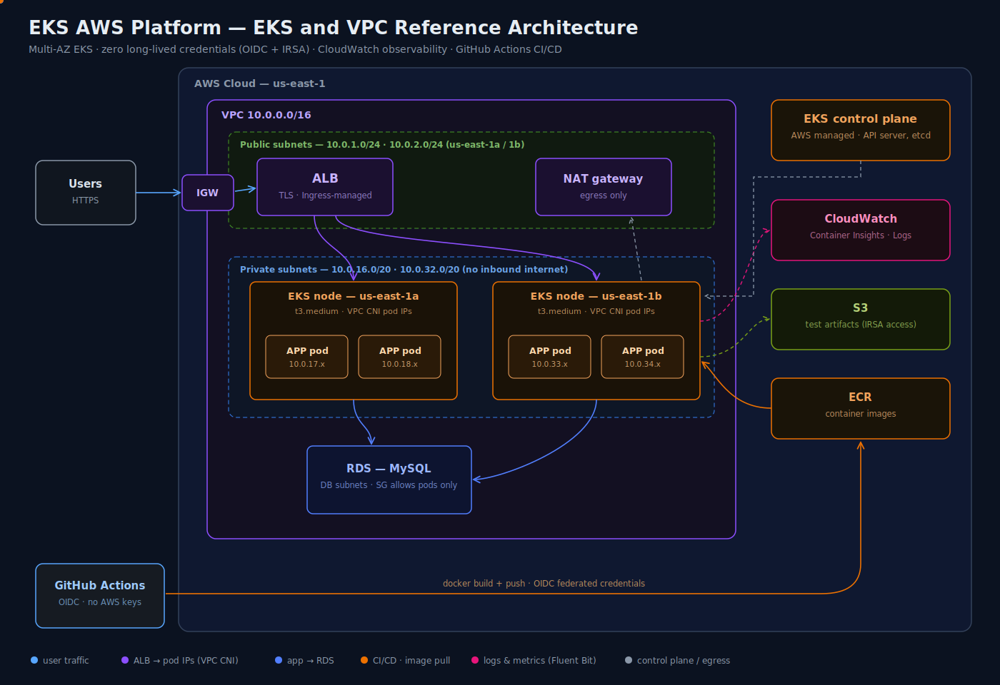

# ITP AWS Platform
### Production-Grade Kubernetes Platform on AWS EKS

---

## Overview

Recently got the opportunity to participate in architecting an application
on AWS from the ground up. It was an incredible learning experience — 
designing VPC networks, provisioning EKS, wiring up security with zero 
long-lived credentials, and building automated pipelines that deploy without 
storing a single AWS key anywhere.

This repository recreates that exact architecture with a demo application.
Every infrastructure decision here is production-grade and documented with 
the reasoning behind it — not just what was built, but why.

---

## Architecture

---

## Why EKS and Not ECS or Elastic Beanstalk

The workload's long-term destination is OpenShift. EKS was chosen 
deliberately — Kubernetes is Kubernetes regardless of whether it runs on 
AWS, OCP, or GKE. The same manifests, images, and pipeline patterns 
transfer without rework. No AWS-native PaaS lock-in.

---

## Key Engineering Decisions

| Decision | Choice | Why |
|---|---|---|
| Networking | VPC CNI | Pods get real VPC IPs — ALB routes directly to pods |
| Subnets | /20 private, /24 public | VPC CNI IP consumption — pods eat IPs fast |
| Multi-AZ | us-east-1a + 1b | EKS and ALB both require 2 AZs minimum |
| Credentials | OIDC everywhere | Zero long-lived keys — GitHub Actions and pods both use identity federation |
| Ingress | ALB Controller | Auto-provisions ALB from Ingress manifest — same pattern as F5 CIS on OCP |
| Observability | OTel Container Insights | Full Kubernetes label enrichment on every metric — drill down by pod, node, namespace |
| Node AMI | Amazon Linux 2023 | Current AWS recommended base — replaces AL2 |
| Endpoint access | Public + Private | Node traffic stays inside VPC, kubectl works from workstation |

---

## Platform Components

| Component | Technology | Purpose |
|---|---|---|
| Network | AWS VPC, Subnets, IGW, NAT | Private network foundation |
| Container Orchestration | EKS 1.33, Managed Node Groups | Kubernetes control plane + worker nodes |
| Ingress | AWS ALB + Load Balancer Controller | External traffic routing |
| Registry | Amazon ECR | Container image storage |
| Database | Amazon RDS | Persistent test metadata |
| Artifact Storage | Amazon S3 | Test reports and run artifacts |
| Observability | CloudWatch + Fluent Bit + OTel | Logs, metrics, dashboards |
| CI/CD | GitHub Actions + OIDC | Automated build and deploy pipeline |
| Security | IAM + IRSA | Zero credential architecture |
| IaC | Terraform | Infrastructure as code |

---

## My Role

Infrastructure and platform layer — end to end:
- Designed VPC network architecture — subnets, routing, security boundaries
- Provisioned EKS cluster with managed node groups across two AZs
- Implemented IRSA-based zero credential model for pods and CI/CD
- Configured CloudWatch observability with Fluent Bit DaemonSet
- Built GitHub Actions pipeline with OIDC — no AWS keys stored anywhere
- Wrote Terraform for full infrastructure reproducibility